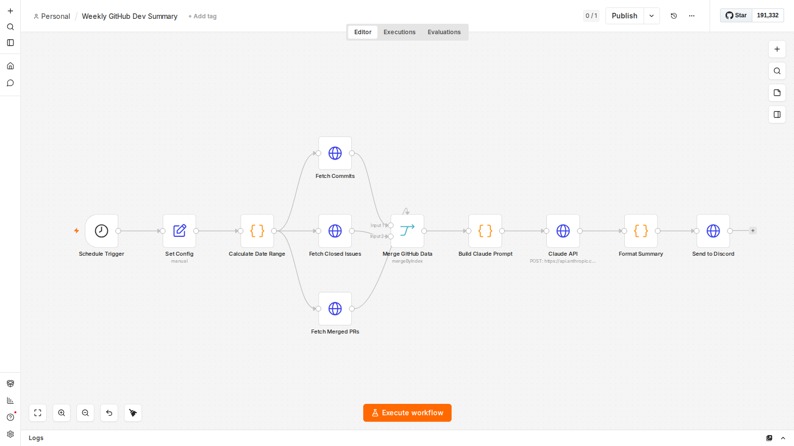

# Weekly GitHub Dev Summary — n8n Workflow

Sends a Claude-generated weekly activity summary for any GitHub repository to Discord every Friday at 5 pm.

**What it does:** Pulls the week's commits, closed issues, and merged PRs from the GitHub API, builds a structured prompt, calls `claude-sonnet-4-20250514`, and posts a rich Discord embed with stats and a narrative summary.



## Setup (5 steps)

### 1. Import the workflow

In n8n, go to **Workflows → Import from file** and select `workflow.json`.

### 2. Set your credentials as n8n environment variables

Add these to your n8n instance (Settings → Environment Variables or via Docker `-e`):

| Variable | Description |
|---|---|
| `GITHUB_TOKEN` | Personal access token with `repo` scope |
| `ANTHROPIC_API_KEY` | Your Anthropic API key |
| `DISCORD_WEBHOOK_URL` | Discord webhook URL for the target channel |

### 3. Configure your repository

Open the **Set Config** node and edit:
- `GITHUB_OWNER` — your GitHub org or username (e.g. `acme-corp`)
- `GITHUB_REPO` — the repository name (e.g. `backend-api`)
- `SUMMARY_LANGUAGE` — `EN` (default) or `FR`

### 4. Validate the workflow structure

```bash
node validate.mjs
```

All checks should pass before activating.

### 5. Activate

Toggle the workflow **Active** in n8n. It runs every Friday at 17:00 UTC. To test immediately, click **Execute Workflow**.

## Architecture

```
Schedule Trigger (Fri 17:00)
  └─ Set Config
       └─ Calculate Date Range
            ├─ Fetch Commits      ──┐
            ├─ Fetch Closed Issues ─┤─ Merge GitHub Data
            └─ Fetch Merged PRs  ──┘
                                     └─ Build Claude Prompt
                                          └─ Claude API
                                               └─ Format Summary
                                                    └─ Send to Discord
```

## Customization

- **Schedule**: Change the cron expression in the **Schedule Trigger** node (`0 17 * * 5` = Friday 5 pm UTC).
- **Language**: Set `SUMMARY_LANGUAGE` to `FR` in the **Set Config** node for French output.
- **Prompt**: Edit the **Build Claude Prompt** node's JS to change tone, length, or focus areas.
- **Delivery**: Replace **Send to Discord** with any HTTP node to route to Slack, email, or another destination.
